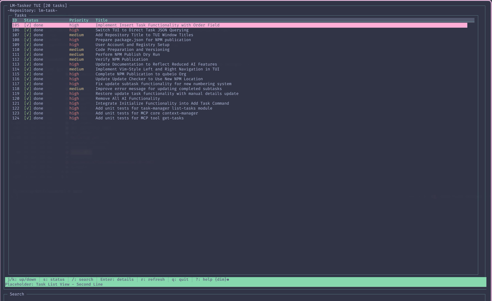
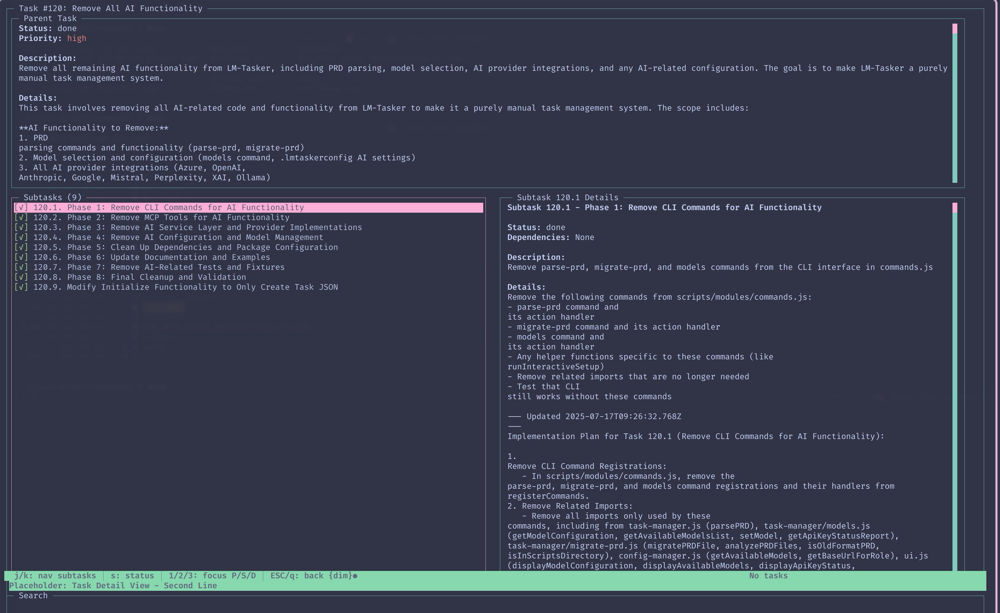

# LM-Tasker

## Overview

**LM-Tasker** is a straightforward task management tool for software development. It favors explicit, manual operations and provides a CLI, a terminal UI (TUI) for in-terminal task browsing and updates, and an MCP server for editor integration. Based heavily on eyaltoledano's excellent https://github.com/eyaltoledano/claude-task-master. I removed all the AI functionality because actually your usual coding assistant/agent paired with Perplexity MCP for research (or just their built-in web search tool call) has enough context to do a great job without it.

### What it offers

- **Manual task management**: Create, organize, and track tasks and subtasks with a clear structure.
- **Dependency management**: Add, remove, validate, and fix task dependencies.
- **Task file generation**: Generate individual, human-readable files for tasks and subtasks.
- **Batch operations**: Update statuses, reorganize, or move tasks in bulk.
- **Editor and CLI integration**: Use the MCP server from supported editors (Cursor, VS Code, Windsurf) or work from the command line.
- **Documentation**: Practical examples and references are included in the repository.

### Core capabilities

- Project initialization (auto-creates structure on first task)
- Task CRUD (create, read, update, delete)
- Status and priority tracking
- Hierarchy reorganization (move tasks/subtasks)
- Configuration and generation utilities

---

## Requirements

LM-Tasker is a manual task management system with no external services. You will need:

- **Node.js** (v14 or higher)
- **npm** or **yarn** for package management

LM-Tasker works offline and doesn't require any API keys or external services.

## Quick Start

### Option 1: MCP (recommended)

The Model Control Protocol (MCP) lets you run LM-Tasker directly from supported editors.

#### 1. Add your MCP config at the appropriate path for your editor

| Editor       | Scope   | Linux/macOS Path                      | Windows Path                                      | Key          |
| ------------ | ------- | ------------------------------------- | ------------------------------------------------- | ------------ |
| **Cursor**   | Global  | `~/.cursor/mcp.json`                  | `%USERPROFILE%\.cursor\mcp.json`                  | `mcpServers` |
|              | Project | `<project_folder>/.cursor/mcp.json`   | `<project_folder>\.cursor\mcp.json`               | `mcpServers` |
| **Windsurf** | Global  | `~/.codeium/windsurf/mcp_config.json` | `%USERPROFILE%\.codeium\windsurf\mcp_config.json` | `mcpServers` |
| **VS Code**  | Project | `<project_folder>/.vscode/mcp.json`   | `<project_folder>\.vscode\mcp.json`               | `servers`    |

##### Cursor & Windsurf (`mcpServers`)

```jsonc
{
  "mcpServers": {
    "lm-tasker": {
      "command": "npx",
      "args": ["-y", "@qubeio/lm-tasker-mcp"],
      "env": {},
    },
  },
}
```

##### VS Code (`servers` + `type`)

```jsonc
{
  "servers": {
    "lm-tasker": {
      "command": "npx",
      "args": ["-y", "@qubeio/lm-tasker-mcp"],
      "env": {},
      "type": "stdio",
    },
  },
}
```

#### 2. (Cursor only) Enable LM-Tasker MCP

Open Cursor Settings (Ctrl+Shift+J) → open the MCP tab → enable `lm-tasker`.

#### 3. Create your first task

In your editor's AI chat pane, say:

```txt
Create a new task for implementing user authentication
```

This initializes the project structure and creates your first task.

#### 4. Continue creating tasks

LM-Tasker uses manual task creation. Create tasks using the MCP tools or CLI commands.

#### 5. Common actions in chat-enabled editors

- Create a task: `Create a new task for implementing user authentication.`
- Find the next task: `What's the next task I should work on?`
- Work on a specific task: `Help me implement task 3.`
- Add subtasks: `Add subtasks to task 4.`

[More examples on how to use LM-Tasker in chat](docs/examples.md)

### Option 2: Command line

#### Installation

```bash
# Install globally
npm install -g @qubeio/lm-tasker

# OR install locally within your project
npm install @qubeio/lm-tasker
```

#### Create your first task (auto-initializes project)

```bash
# If installed globally
lm-tasker add-task --title="Task Title" --description="Task description"

# If installed locally
npx @qubeio/lm-tasker add-task --title="Task Title" --description="Task description"
```

This creates the `tasks.json` file and project structure when you add your first task.

#### Common Commands

```bash
# Create first task (auto-initializes project)
lm-tasker add-task --title="Task Title" --description="Task description"

# List all tasks
lm-tasker list

# Show the next task to work on
lm-tasker next

# Generate task files
lm-tasker generate
```

## Terminal UI (TUI)

LM-Tasker includes a full-screen terminal UI for browsing tasks and viewing details.

### Launch

```bash
# Start the TUI
lm-tasker ui

# Alias
lm-tasker tmui

# Specify a tasks file explicitly
lm-tasker ui --file ./tasks/tasks.json
```

### Navigation

- Arrow keys or j/k: move selection
- Enter: open task details
- s: update task status (opens status modal)
- Esc or q: go back/exit
- h/l: navigate between list and detail views

The window title includes the current repository name to help distinguish sessions.

### Screenshots

<!-- Insert screenshot of the task list view -->


<!-- Insert screenshot of the task detail view -->


The TUI reads data directly from `tasks.json`. Ensure it exists before launching.

## Documentation

For details, see the documentation in the `docs` directory:

- [Configuration](docs/configuration.md) — Environment and customization
- [Tutorial](docs/tutorial.md) — Getting started
- [Command reference](docs/command-reference.md) — Available commands
- [Task structure](docs/task-structure.md) — Task format and features
- [Examples](docs/examples.md) — Common editor interaction workflows

## Troubleshooting

### If `lm-tasker add-task` doesn't respond

Try running it with Node directly:

```bash
node node_modules/lm-tasker/bin/lm-tasker.js add-task --title="Task Title" --description="Task description"
```

Or clone the repository and run:

```bash
cd lm-tasker
npm install
npx lm-tasker add-task --title="Task Title" --description="Task description"
```

### Codex (or strict MCP clients) can't load the server

Some MCP clients – Codex in particular – reject any non-JSON text that appears on stdout while the
server is connected over stdio. Earlier versions of LM-Tasker logged startup banners to stdout,
which meant Codex aborted the handshake immediately even though Claude/Desktop would tolerate it.
Upgrade to the latest version (or pull `main`) so logging goes to stderr only. If you maintain a
fork, make sure any `console.log` statements are replaced with stderr logging before the MCP server
starts.

## Development Workflow

This repository now ships with a `Taskfile.yml` so common actions can be run with [GoTask](https://taskfile.dev).
Typical examples:

```bash
# Run the fast Jest suite
task test

# Run coverage
task test:coverage

# Check formatting
task lint
```

All tasks automatically set `LMTASKER_SKIP_MCP_AUTOSTART=1` so the MCP server does not auto-run
during unit tests.
